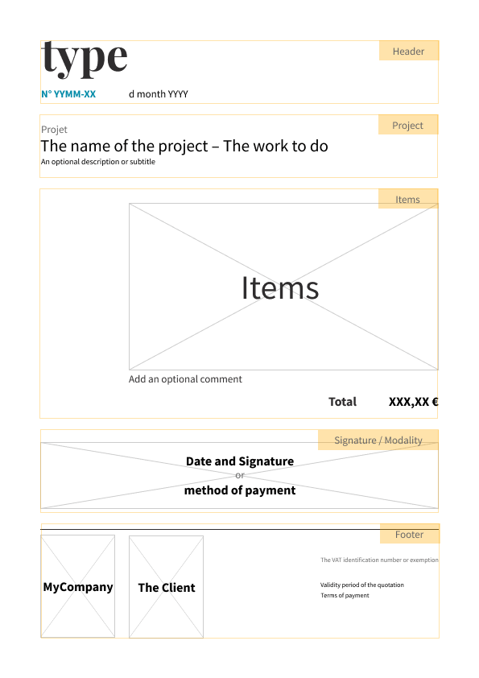

# Monkfish's dashboard

This application allows you to manage the accounting of a micro-entreprise (customers, quotations, invoices, payments).

> React + Express + Router + SQLite + Knex

## Installation

Clone the repository or copy it on your disk, and go to the project root directory.
Then, run Yarn to install dependencies.

```bash
git clone https://github.com/Monkfish-FR/dashboard.git
cd dashboard
yarn install
```

## Usage

### Start from scratch

The database provided by the project is empty (no recorded data). To start the project and create clients, quotations, invoices… Run these commands from the project root directory:

- Create the database: _(the database is `server/database/database.sqlite`)_
```bash
yarn run db:migrate:update
```

- Start the application:
```bash
yarn start
```

### Start with data

To start with existing data, run these commands from the project root directory:

- Create the database: _(the database is `server/database/dummy/dummyDB.sqlite`)_
```bash
yarn run dummy:migrate:update
```

- Populate the database:
```bash
yarn run dummy:seed:run
```

- Start the application:
```bash
yarn run dummy
```

> Note: you can switch between these 2 environments with the `start` and `dummy` Yarn scripts

### Configure your application

Before starting, edit the `./src/settings.json` with your own information. The table below lists the available variables:

| Variable        | Type   | Description                                             |
|-----------------|--------|---------------------------------------------------------|
| name            | string | Your company name                                       |
| fullName        | string | Your first and last name                                |
| email           | string | Your e-mail address                                     |
| siret           | string | Your SIRET number (14 digits)                           |
| address         | string | Your postal address                                     |
| locality        | string | Your postal code and city                               |
| __Mentions__    |        |                                                         |
| tva             | string | Your VAT number or the exemption reason                 |
| validity        | string | The validity period of a quotation                      |
| _Payment_       |        |                                                         |
| limit           | number | The limit for requesting a deposit (in €)               |
| rate            | number | The rate of the deposit (0.5 = 50%)                     |
| over            | string | The phrase to display when the amount exceeds the limit |
| under           | string | The phrase to display otherwise                         |
| __Payment__     |        |                                                         |
| iban            | string | Your bank account number                                |
| bic             | string | The identifier code of your bank                        |
| order           | string | The order to write on the check                         |
| paymentTerm     | number | The payment term in month                               |
| __Reporting__   |        |                                                         |
| interval        | number | If you are a monthly payer, type 1; 3 for quarterly     |
| dueMonths       | array  | The months when a quarterly payer reports its income    |
| concernedMonths | object | The months concerned in each quarter                    |

## Features

- Easily visualize useful data on Homepage: incomes, reminder…

- Generates __PDF__ (with the [React-pdf](https://react-pdf.org/) package) _– see below for templating_ – for quotations and invoices

- Manages __deposit and balance__ for invoices

- Allows __discount__ for invoices

- __Filter__ quotations and invoices by client and status (_in progress | done | cancelled_ and _pending | paid_)

### PDF Templating

The application generates PDF for Quotations and Invoices. It provides a template presented in the `PDFTemplate` component. The structure is (components are in yellow):

[](./public/pdf_template.png)

_see [Quotation example](./public/pdf_quotation.png) and [Invoice example](./public/pdf_invoice.png) in the `./public` folder._


